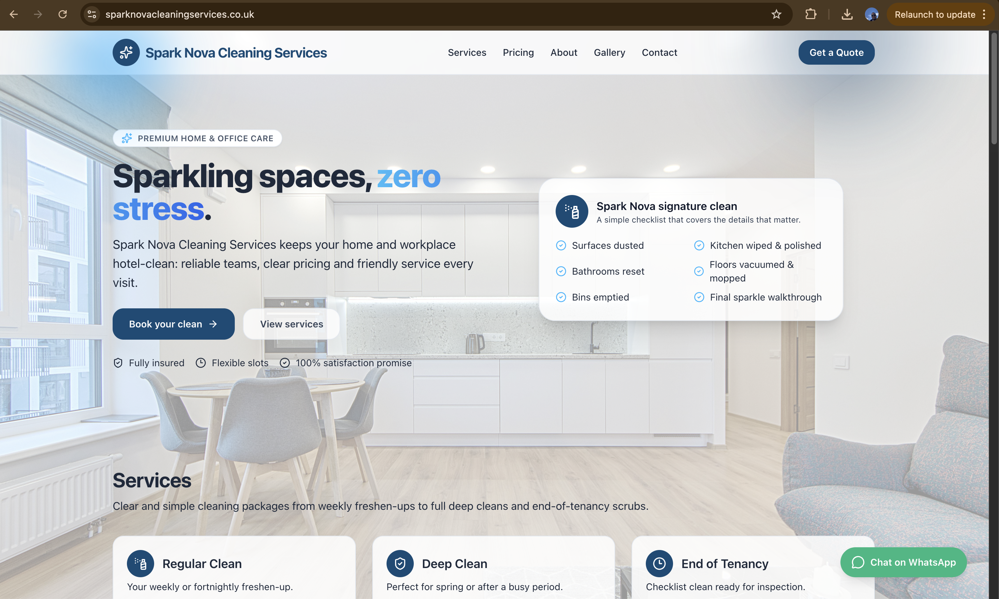
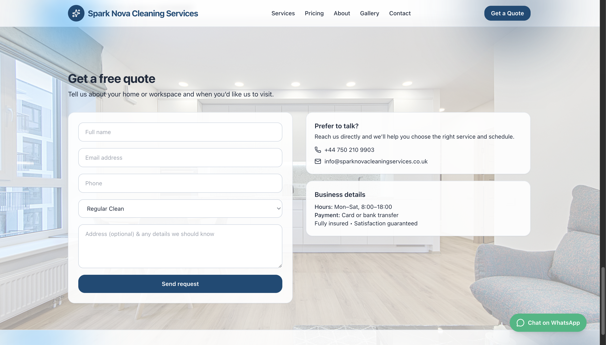

# Spark Nova Cleaning Services Website

A responsive business website developed to showcase cleaning services, pricing, and customer interaction features for a local service-based company.

This project focuses on user experience, clean UI design, and conversion-driven layout for real-world business use.

---

## 📸 Website Preview  

### Homepage  

### Get a Quote  

---

## 🧠 Project Overview

This project demonstrates the design and development of a modern service-based business website. It focuses on clear service presentation, smooth navigation, and user-friendly interaction to improve customer engagement and lead generation.

---

## ⚙️ Features

- Service listing and pricing structure
- Customer quote request form
- Responsive design for mobile and desktop
- Clean and modern user interface

---

## 🎯 Purpose

The goal of this project was to build a real-world business website that helps a company present its services clearly, attract customers, and generate leads through an intuitive and professional design.

---
## 🛠️ Technologies Used

- HTML
- CSS
- JavaScript
- Responsive Design Principles

## 👤 Author

PraiseGod Eze  
Cybersecurity Student | SOC Analyst (Aspiring)  
Founder of Sentia Technologies  

[LinkedIn](https://www.linkedin.com/in/praisegod-eze-67728b306)
